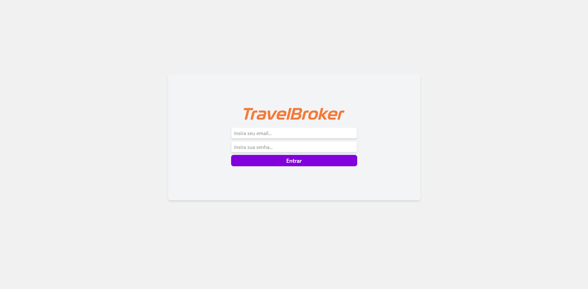
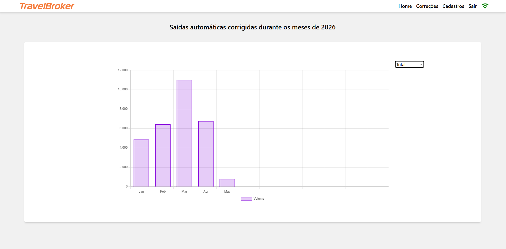
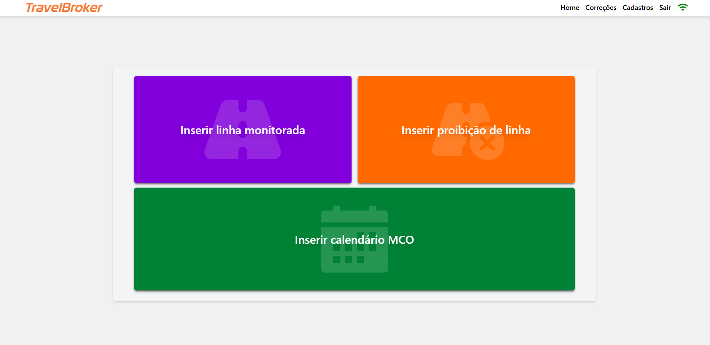
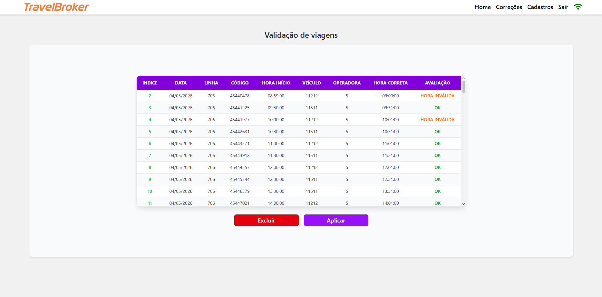

# TravelBroker


Aplicação web desenvolvida para **validação, correção e monitoramento de viagens de ônibus**, auxiliando na identificação de inconsistências de horário geradas por saídas automáticas e permitindo aplicar correções de forma controlada.

## Visão geral

O **TravelBroker** foi criado para resolver um problema operacional real relacionado à conferência de viagens no transporte público. A aplicação permite importar uma planilha com viagens, consultar os dados atuais em uma API externa, validar horários, identificar registros inconsistentes e aplicar correções quando necessário.

Além da correção das viagens, o sistema também possui autenticação, dashboard com gráficos, monitoramento de linhas, cadastro de linhas proibidas e controle de calendário MCO para evitar correções indevidas em períodos já processados.

## Deploy

```txt
https://travel-broker.vercel.app
```

## Demonstração

### Login



### Dashboard de correções



### Cadastros operacionais



### Validação de viagens



## Funcionalidades

* Autenticação de usuários com Firebase Authentication.
* Proteção de rotas privadas.
* Upload e leitura de planilhas Excel.
* Validação de viagens com base em linha, código, horário e operadora.
* Consulta de informações de viagem em API externa.
* Identificação de horários inválidos.
* Aplicação de correções por endpoint dedicado.
* Geração de horário alternativo quando a saída manual está inconsistente.
* Controle de linhas monitoradas.
* Bloqueio de linhas proibidas para impedir correções automáticas.
* Cadastro e consulta de calendário MCO.
* Dashboard com gráficos de correções por mês e por linha.
* Armazenamento de métricas no Firestore.
* Indicação visual de disponibilidade da API.
* Notificações de sucesso, erro e alerta para o usuário.
* Persistência de dados temporários no `localStorage`.

## Problema que o projeto resolve

Em operações de transporte, algumas viagens podem apresentar inconsistências de data ou horário por falhas de sincronização, lançamentos incorretos ou comportamento inesperado de sistemas embarcados.

Corrigir esse tipo de divergência manualmente pode ser demorado, repetitivo e sujeito a erro humano. O **TravelBroker** centraliza esse fluxo em uma interface web, permitindo validar grandes volumes de registros, indicar quais viagens precisam de correção e aplicar as alterações com mais segurança.

## Fluxo principal

1. O usuário faz login na aplicação.
2. A aplicação verifica se a API externa está disponível.
3. O usuário acessa a tela de correções.
4. Uma planilha Excel com viagens é enviada.
5. O sistema lê os dados da planilha e estrutura as informações.
6. Para cada viagem, o sistema consulta a API externa.
7. Os horários são comparados com os dados informados na planilha.
8. O sistema classifica cada item como `OK`, `HORA INVÁLIDA`, `PROCESSADA` ou bloqueado por regra.
9. O usuário revisa os dados na tabela.
10. As correções são aplicadas somente após confirmação.
11. O Firestore é atualizado com métricas e contadores operacionais.
12. O dashboard exibe os resultados consolidados.

## Módulos do sistema

### Login

Tela responsável pela autenticação do usuário. O acesso ao restante do sistema é protegido por rotas privadas.

### Home / Dashboard

Tela inicial com gráficos de acompanhamento. Permite alternar entre visualização geral de correções e correções por linhas monitoradas.

### Correções

Módulo principal do sistema. Responsável pelo upload da planilha, validação dos dados, exibição da tabela de viagens e aplicação das correções.

### Cadastros

Tela de acesso aos cadastros operacionais do sistema:

* Inserir linha monitorada.
* Inserir proibição de linha.
* Inserir calendário MCO.

### Linhas monitoradas

Permite registrar linhas que devem ter suas correções acompanhadas individualmente em contadores no Firestore.

### Linhas proibidas

Permite cadastrar linhas que não devem ser corrigidas automaticamente.

### Calendário MCO

Controle usado para validar se determinado período já foi processado, evitando alterações indevidas em registros operacionais fechados.

## Tecnologias utilizadas

* **React**
* **TypeScript**
* **Vite**
* **Tailwind CSS**
* **Firebase Authentication**
* **Cloud Firestore**
* **Axios**
* **Chart.js**
* **React Chart.js 2**
* **React Router DOM**
* **React Toastify**
* **React Icons**
* **read-excel-file**
* **date-fns**
* **ESLint**
* **Vercel**

## Estrutura do projeto

```txt
TravelBroker/
├── public/
├── src/
│   ├── components/
│   │   ├── charts/              # Componentes de gráficos
│   │   ├── container/           # Container visual das páginas
│   │   ├── header/              # Cabeçalho e navegação
│   │   ├── input/               # Inputs reutilizáveis
│   │   └── layout/              # Layout principal da aplicação
│   ├── contexts/
│   │   └── mainContext.tsx      # Contexto global: autenticação, token, API, gráficos e linhas
│   ├── pages/
│   │   ├── broker/              # Upload, validação e aplicação de correções
│   │   ├── home/                # Dashboard com gráficos
│   │   ├── linesmonitor/        # Cadastro e consulta de linhas monitoradas
│   │   ├── login/               # Tela de autenticação
│   │   ├── mcocalendary/        # Calendário MCO
│   │   ├── prohibitedlines/     # Linhas proibidas
│   │   └── registrations/       # Menu de cadastros
│   ├── routes/
│   │   └── privateRoutes.tsx    # Proteção das rotas privadas
│   ├── services/
│   │   ├── api/                 # Configuração das APIs externas
│   │   └── firebase/            # Configuração do Firebase
│   ├── index.css
│   ├── main.tsx
│   └── router.tsx
├── index.html
├── package.json
├── vite.config.ts
├── tsconfig.json
├── vercel.json
└── README.md
```

## Pré-requisitos

Antes de executar o projeto, tenha instalado:

* Node.js
* npm ou outro gerenciador de pacotes compatível
* Projeto Firebase configurado
* Acesso às APIs externas utilizadas para consulta e correção de viagens

## Como executar localmente

Clone o repositório:

```bash
git clone https://github.com/Mateusdev3/TravelBroker.git
```

Acesse a pasta:

```bash
cd TravelBroker
```

Instale as dependências:

```bash
npm install
```

Crie um arquivo `.env` na raiz do projeto:

```env
VITE_API_TRAVEL=
VITE_API_SETTRAVEL=
VITE_TRAVEL_PING_NUMBER=

VITE_FIREBASE_API_KEY=
VITE_FIREBASE_AUTH_DOMAIN=
VITE_FIREBASE_PROJECT_ID=
VITE_FIREBASE_STORAGE_BUCKET=
VITE_FIREBASE_MESSAGING_SENDER_ID=
VITE_FIREBASE_APP_ID=
VITE_FIREBASE_MEASUREMENT_ID=
```

Execute o projeto:

```bash
npm run dev
```

Acesse no navegador:

```txt
http://localhost:5173
```

## Scripts disponíveis

```bash
npm run dev       # Inicia o servidor de desenvolvimento
npm run build     # Gera a build de produção
npm run preview   # Executa o preview da build
npm run lint      # Executa a verificação de lint
```

## Variáveis de ambiente

| Variável                            | Descrição                                               |
| ----------------------------------- | ------------------------------------------------------- |
| `VITE_API_TRAVEL`                   | URL base da API usada para consultar viagens.           |
| `VITE_API_SETTRAVEL`                | URL base da API usada para aplicar correções.           |
| `VITE_TRAVEL_PING_NUMBER`           | Identificador usado para testar disponibilidade da API. |
| `VITE_FIREBASE_API_KEY`             | Chave pública do projeto Firebase.                      |
| `VITE_FIREBASE_AUTH_DOMAIN`         | Domínio de autenticação do Firebase.                    |
| `VITE_FIREBASE_PROJECT_ID`          | ID do projeto Firebase.                                 |
| `VITE_FIREBASE_STORAGE_BUCKET`      | Bucket de armazenamento do Firebase.                    |
| `VITE_FIREBASE_MESSAGING_SENDER_ID` | ID de envio de mensagens do Firebase.                   |
| `VITE_FIREBASE_APP_ID`              | ID da aplicação Firebase.                               |
| `VITE_FIREBASE_MEASUREMENT_ID`      | ID de medição do Firebase Analytics.                    |


## Coleções utilizadas no Firestore

| Coleção           | Finalidade                                          |
| ----------------- | --------------------------------------------------- |
| `CHART`           | Armazena métricas mensais de correções realizadas.  |
| `MONITORED_LINES` | Armazena linhas monitoradas e seus contadores.      |
| `PROHIBILE_ROWS`  | Armazena linhas proibidas para correção automática. |
| `MCO`             | Armazena informações de processamento por mês/dia.  |

## Formato esperado da planilha

A planilha importada deve possuir colunas compatíveis com o fluxo de validação da aplicação, contendo informações como:

| Campo        | Descrição                               |
| ------------ | --------------------------------------- |
| Data         | Data da viagem.                         |
| Linha        | Linha operacional.                      |
| Código       | Código/identificador da viagem.         |
| Hora início  | Horário original da viagem.             |
| Veículo      | Identificação do veículo.               |
| Operadora    | Código da operadora.                    |
| Hora correta | Horário que deve ser validado/aplicado. |

## Regras de validação

Durante o processamento, a aplicação avalia:

* Se a viagem existe na API externa.
* Se a linha está cadastrada como proibida.
* Se a viagem já está processada no calendário MCO.
* Se o horário informado é válido.
* Se é necessário gerar um horário alternativo.
* Se a API de correção respondeu corretamente.

Quando o horário manual é inválido, a aplicação pode gerar um novo horário com base no horário de saída retornado pela API, adicionando um pequeno ajuste de tempo antes de enviar a correção.

## Monitoramento da API

O sistema possui uma verificação periódica de disponibilidade da API externa. Quando a API está indisponível, o usuário é alertado e o acesso operacional pode ser bloqueado para evitar correções em ambiente instável.

## Boas práticas de uso

* Validar a planilha antes de aplicar qualquer correção.
* Processar lotes menores quando a API estiver instável.
* Conferir linhas proibidas antes de executar uma correção em massa.
* Confirmar se o calendário MCO está atualizado.
* Não expor tokens, URLs internas ou credenciais em repositórios públicos.
* Utilizar ambiente de homologação antes de aplicar mudanças em produção.

## Objetivo técnico

Este projeto demonstra conhecimentos em:

* Desenvolvimento front-end com React e TypeScript.
* Construção de SPA com Vite.
* Autenticação e proteção de rotas.
* Integração com Firebase Auth e Firestore.
* Consumo de APIs REST com Axios.
* Leitura e processamento de planilhas Excel.
* Manipulação e comparação de datas/horários.
* Atualização de métricas em banco NoSQL.
* Criação de dashboards com Chart.js.
* Organização de contexto global com React Context API.
* Deploy de aplicação web na Vercel.

## Melhorias futuras

* Criar tela de histórico de correções aplicadas.
* Adicionar exportação de relatório em Excel ou PDF.
* Implementar paginação na tabela de validação.
* Adicionar filtros por data, linha, operadora e status.
* Criar confirmação dupla para correções em massa.
* Melhorar responsividade em telas menores.
* Adicionar testes automatizados para validação de planilhas.
* Separar regras de negócio em serviços reutilizáveis.
* Criar logs estruturados de correção.
* Implementar controle de permissões por perfil de usuário.

## Autor

Desenvolvido por **Mateus Esteves**.

## Licença

Projeto de uso interno/privado. Caso deseje torná-lo público para reutilização, adicione uma licença adequada ao repositório.
